# Project Java RMI Market

## Authors
- José Augusto Cenci Castilho
- Jadir Pires de Borba Junior

## Features
- Client-server architecture using Java RMI.
- Remote object interaction.
- Market functionalities:
    - Insert a Product
    - Update a Product
      - When Update notify all clients
    - List all products
    - List all products from one market
    - List all products with one name
    - Client Login
    - Client Logout
- Server functionalities:
  - Logs

## Project Structure
```
src/
├── client
│   ├── utils
│   │   └── MenuHandler.java
│   └── Client.java
├── contracts
│   ├── ClientRemoteInterface.java
│   └── ServerRemoteInterface.java
├── docs/
│   ├── Anotacoes.txt
│   ├── Trabalho2.pdf
├── entities
│   ├── Product.java
│   └── User.java
├── server
│   ├── controllers
│   │   ├── ProductController.java
│   │   └── UserController.java
│   ├── database
│   │   ├── productsList.txt
│   │   └── usersList.txt
│   ├── handlers
│   │   └── FileHandler.java
│   ├── interfaces
│   │   ├── IProductController.java
│   │   └── IUserController.java
│   ├── utils
│   │   ├── Cache.java
│   │   └── Server.java
├── utils
│   └── DateUtils.java
```

## Screenshots

### Server Start
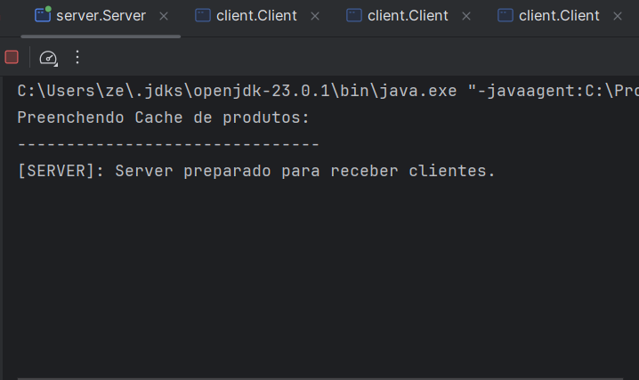

### Client Start
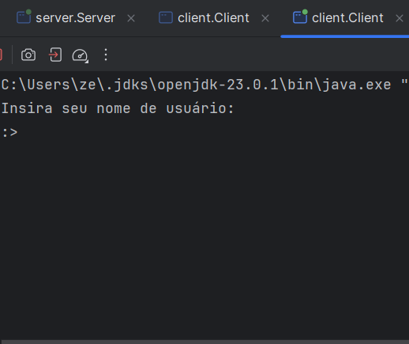

### Client 'adm' Login
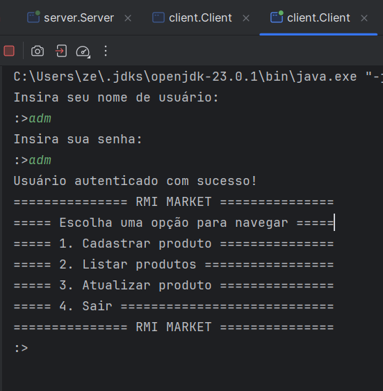

### Server Feedback to Client 'adm' Login
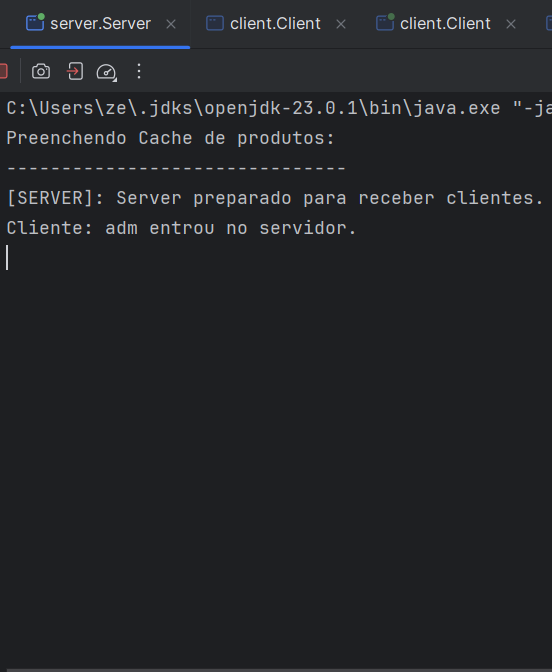

### Client 'ze' Login
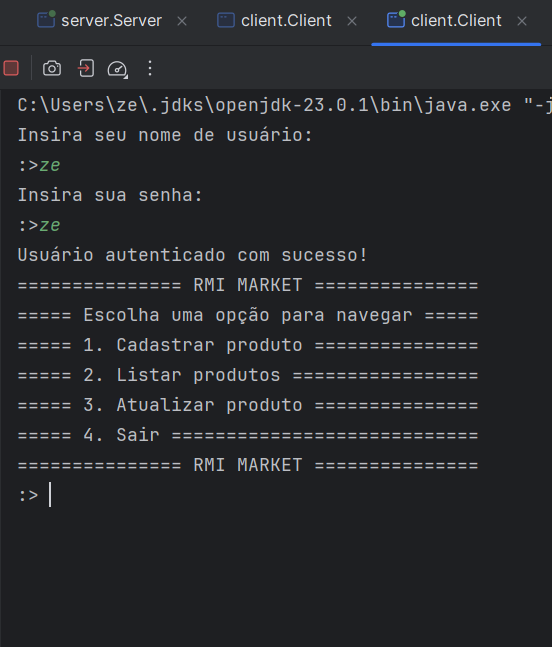

### Server Feedback to Client 'ze' Login
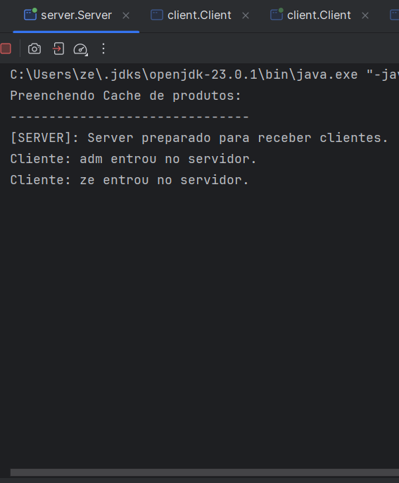

### Client 'ze' Insert Product
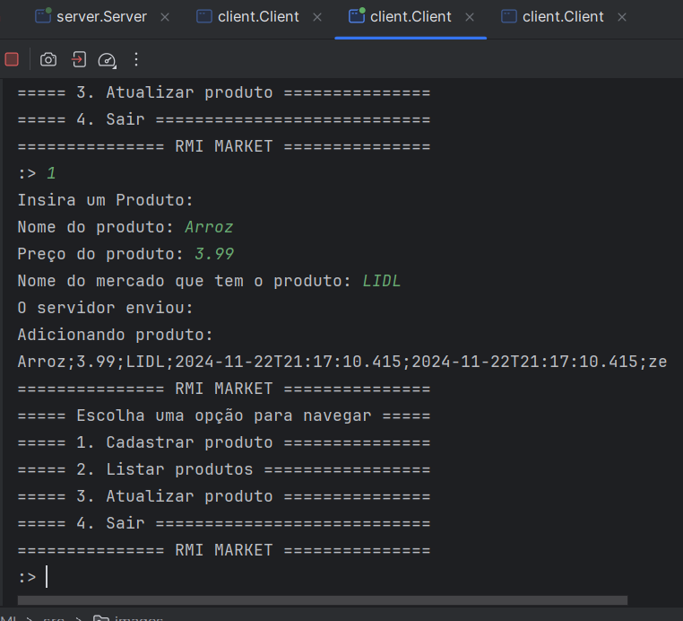

### Menu to choose type of list
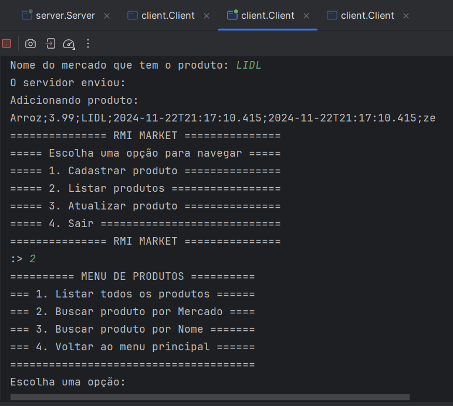

### List all products
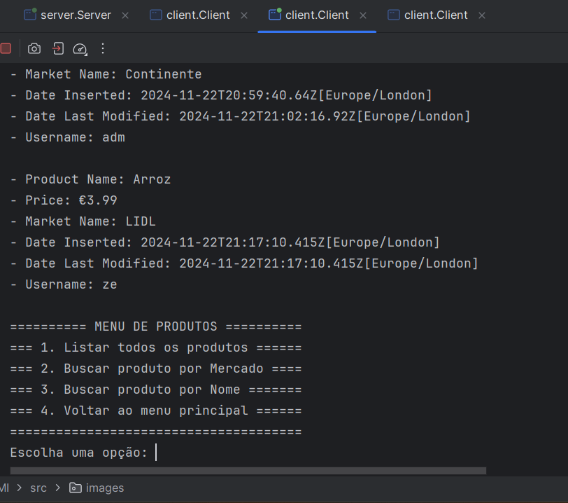

### List products by market
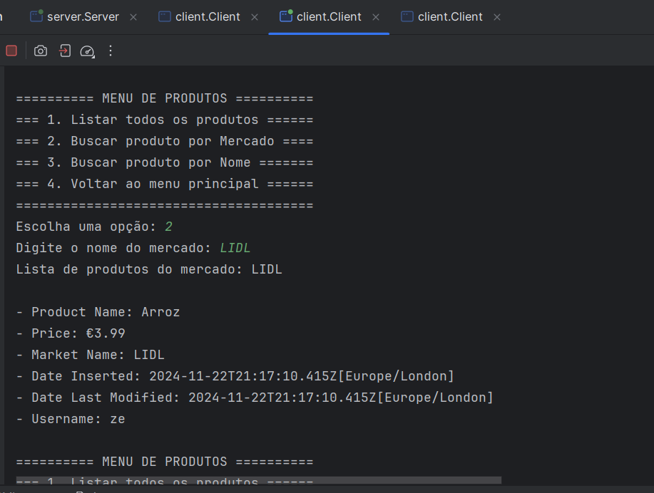

### List product by name


### Client 'ze' update product
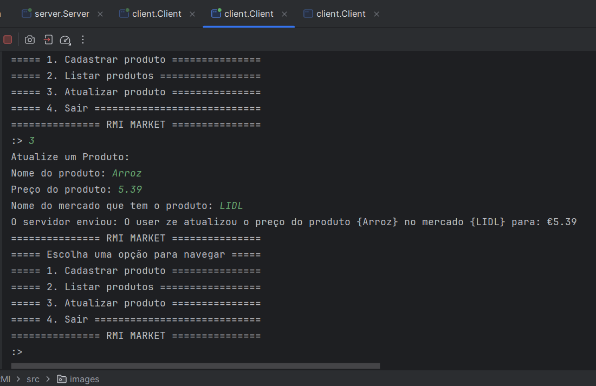

### Notify All Clients update product
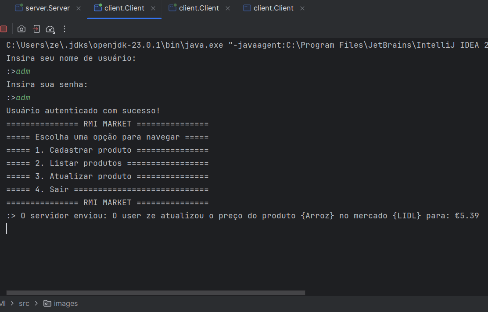

### Server Logs
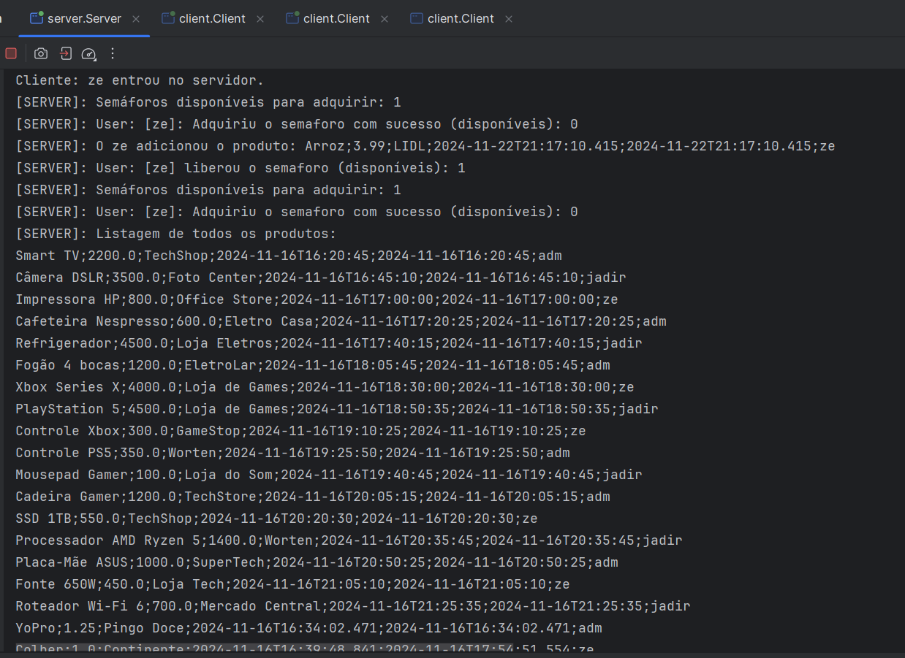
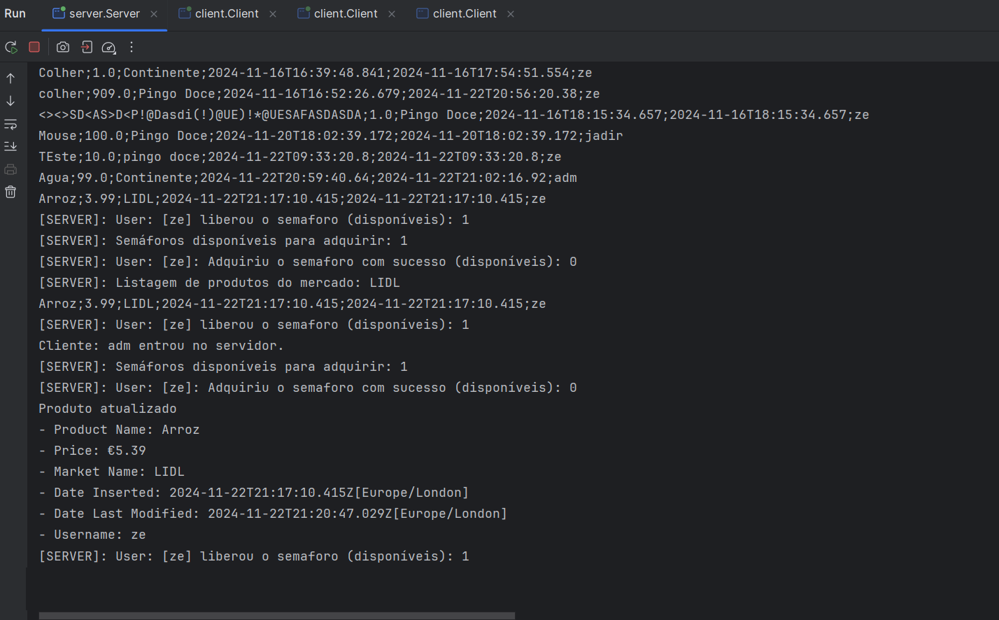


## Contact
For any questions or suggestions, please contact:
- José Augusto Cenci Castilho: 
  - [dev.zecenci@gmail.com]
  - [https://www.linkedin.com/in/jose-augusto-cenci-castilho-94282420a/]
- Jadir Pires de Borba Junior:
  - [jadirjunior8@gmail.com]
  - [https://www.linkedin.com/in/jadir-borba-junior/]
